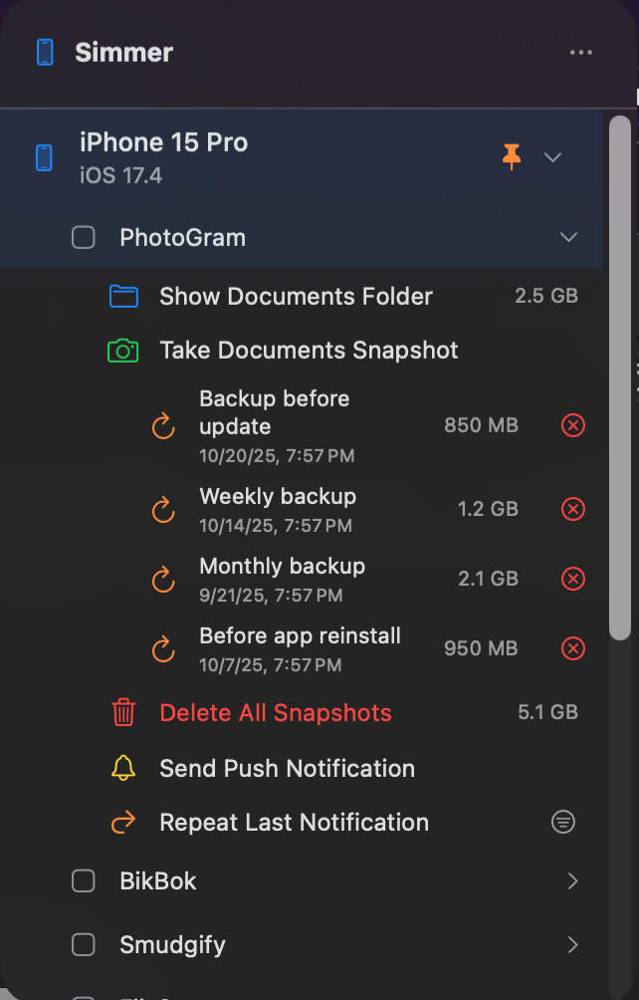

# Simmer

A macOS menubar app for iOS Simulator management. Quickly browse simulators, inspect installed apps, open Documents folders, and snapshot/restore app data.

  

## Features

- **Simulator overview**
  - Recently used simulators with name, iOS version, and device icon
  - Pin/unpin for quick access

- **Installed apps per simulator**
  - App list with icons and names
  - Automatic refresh and path revalidation when apps are reinstalled

- **Documents folder tools**
  - Open an app's Documents directory in Finder
  - Live size readout for Documents

- **Snapshots for app data**
  - Take, restore, rename, and delete snapshots of Documents
  - Restore validation, retry logic, and progress feedback
  - Delete all snapshots with total size shown

- **Push notification helpers**
  - Compose and send test notifications to a selected simulator
  - Repeat last notification; pick from saved history

- **In-app updates**
  - Sparkle integration for update checks from the menu

## Download

Get the latest release from the GitHub Releases page.

- Releases: [`sdenowh/simmer · Releases`](https://github.com/sdenowh/simmer/releases)

## Build

- Xcode 15+ on macOS 14+
- Open `Simmer.xcodeproj` and run, or execute `./Simmer/build.sh`

## License

MIT — see [`LICENSE`](LICENSE). © 2025 Scott Denowh

## About

- Repository: [`github.com/sdenowh/simmer`](https://github.com/sdenowh/simmer)
- Issues & feedback: open an issue on the repo
